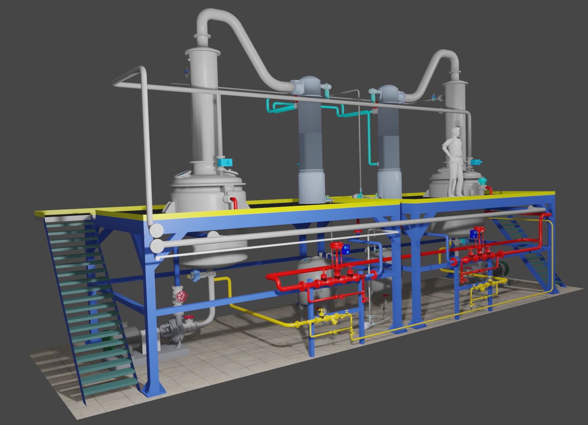
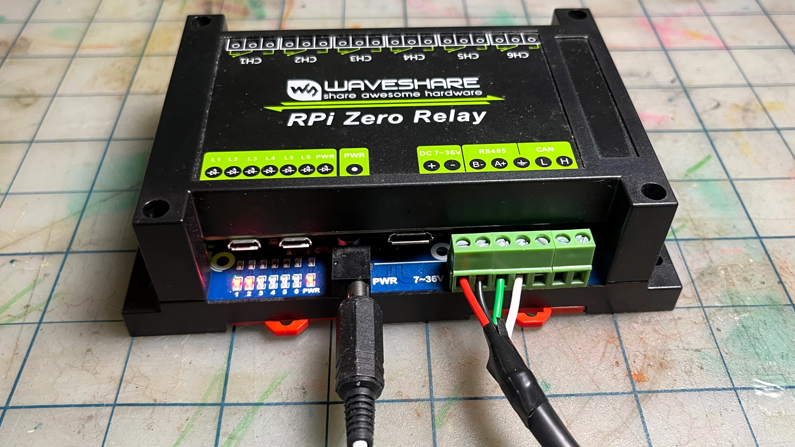
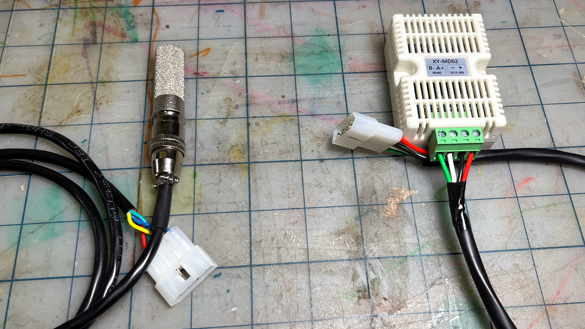

# BrewHub.Net: Multi-stack IoT Architecture

BrewHub.Net is an IoT reference architecture using .NET-based device software, InfluxDB and Grafana on a multi-node edge cluster, connected to Azure Services on the backend, with a Vue.JS dashboard for user monitoring and control.

More details: [BrewHub.Edge](https://github.com/jcoliz/BrewHub.Edge)



## What's Here: Six-Unit Distillery Prototype

The Six-Unit Distillery is a prototype implementation to demonstrate the BrewHub.Net IoT Reference Architecture across the device, edge, cloud, and web stacks. This repository contains the device control software for the prototype.

Originally created for a spirits distiller, the prototype presents a simplified version of the industrial continuous distillation
equipment illustrated above. While there are **nineteen** components on the full version, this scaled-down prototype 
works the same way, it's just easier to explain.

We use the term "six-unit" here to refer to the components of the device model which are surfaced on the dashboard. Those units here are:

* **Device**: The device itself. For the prototype, we ran on a [Waveshare RPi Zero Relay](https://www.waveshare.com/rpi-zero-relay.htm).
* **Ambient Conditions**: A temperature and humidity sensor providing details about the conditions in the room where the equipment is installed.
* **Reflux Thermostat**: Controls the temperature at the top of the rectifier column by opening or closing the Reflux Valve
* **Reflux Valve**: Controls the flow of reflux (fully distilled product) introduced at the top of the rectifier column. By opening the reflux valve, the temperature is reduced through the inflow of cooled product.
* **Condenser Thermostat**: Controls the temperature at the bottom of the condenser tower by opening or closing the Consender Valve.
* **Condenser Valve**: Controls the flow of cold water circulated through the condenser column. This water removes the heat from the product which was added earlier in the process.

## Getting Started

The fastest way to get started is bring up an instance of the [BrewHub.Net Edge Stack](https://github.com/jcoliz/BrewHub.Edge),
while including the optional controllers to generate synthetic data. Those controllers are instances of the Six-Unit Distillery device controller in a container. Of course, device software doesn't run in a container in a real system, however this will get a demo
up and running quickly.

```
$ git clone https://github.com/jcoliz/BrewHub.Edge
$ cd BrewHub.Edge
$ docker compose -f docker-compose.yml -f docker-compose-controllers.yml up -d
```

## Building Locally

The controller is built on .NET 7.0. To build it, you'll need the [.NET SDK](https://dotnet.microsoft.com/en-us/download) installed on your machine.

When running, it will need to know where to look for an MQTT broker, and (optionally) what to use as a deviceid (client id) when connecting. You can use any supported .NET configuration method, or you can create a `config.toml` file in the project root:

```toml
[mqtt]
server = "localhost"

[provisioning]
deviceid = "your-device-name"
```

Once you're configured, simply `dotnet run` to get started.

```
$ dotnet run
<6> [ 17/06/2023 19:18:08 ] MqttWorker[100] Started OK
<6> [ 17/06/2023 19:18:08 ] MqttWorker[200] Initial State: OK Applied 9 keys
<6> [ 17/06/2023 19:18:08 ] MqttWorker[101] Device: BrewHub 6-Unit Distillery Prototype v1 S/N:1234567890-ABCDEF ver:0.0.0
<6> [ 17/06/2023 19:18:08 ] MqttWorker[102] Model: dtmi:brewhub:prototypes:still_6_unit;1
<6> [ 17/06/2023 19:18:08 ] MqttWorker[300] Provisioning: OK. Device your-device-name
<6> [ 17/06/2023 19:18:08 ] MqttWorker[400] Connection: OK.
<6> [ 17/06/2023 19:18:09 ] MqttWorker[500] Telemetry: OK 4 messages
<6> [ 17/06/2023 19:18:09 ] MqttWorker[720] Property: Reported OK. Next update after 00:01:00
```

Open up the dashboard on `http://localhost:80`, and you'll soon see `your-device-name` show up with its new data.

## Running on Raspberry Pi



The controller software is designed to run on a [Waveshare RPi Zero Relay](https://www.waveshare.com/wiki/RPi_Zero_Relay). 
It will work on any device which runs .NET 7, has an RS485 converter attached to a serial port, and has 12V relays.

### Prepare

The controller requires the .NET 7 runtime. Unfortunately, as of this writing, Microsoft doesn't
publish ARM64 packages for dotnet components. Instead, you can use the [dotnet-install script](https://learn.microsoft.com/en-us/dotnet/core/tools/dotnet-install-script) to pull down the latest runtime(s).

Here's my recommended usage to install for system-wide usage. Install both the 6.0 and 7.0
runtimes for maximum compatibility.

```
$ sudo ./dotnet-install.sh --runtime dotnet --channel 7.0 --install-dir /opt/dotnet
$ sudo ./dotnet-install.sh --runtime dotnet --channel 6.0 --install-dir /opt/dotnet
```

Then, create `/etc/profile.d/dotnet.sh` with these contents:

```
export DOTNET_ROOT=/opt/dotnet
export PATH=$PATH:/opt/dotnet
```

Finally, use the `raspi-config` tool to enable the hardware serial port, and disable login shell
over serial. This will enable the serial port to listen to the onboard SP3485EN IC which handles the RS485 to serial translation.

### Install

Debian packages for ARM64 are automatically created during both the CI and Release pipelines for the controller.
These are hosted on the BrewHub [universal packages feed](https://dev.azure.com/jcoliz/BrewHub/_artifacts/feed/brewhub-debs) on Azure DevOps. These can simply be downloaded and installed onto
the target hardware.

Download from Azure DevOps:
```
PS> az artifacts universal download --organization "https://dev.azure.com/jcoliz/" --project "8257bdfd-5bba-4d04-a064-9d1c720d3b35" --scope project --feed "brewhub-debs" --name "still6unitcontroller" --version "0.1.11" --path bin
```

Transfer to target machine:
```
PS> scp .\bin\arm64\still6unitcontroller_0.1.11_arm64.deb user@hostname:
```

On the target machine:
```
$ sudo apt install ./still6unitcontroller_0.1.11_arm64.deb
```

### Configure

Before running, you'll need to configure the controller. Copy the `config.template.toml` file in this
repository to `/opt/still6unitcontroller/config.toml` on the target device then make the needed changes.

In typical usage, the controller will send its rea~dings to an MQTT broker. If you have that up, 
enter this in the config file, and that's all you need.

```toml
[mqtt]
server = "hostname"
```

Otherwise, you can tell the controller to simply run by itself as a standalone component, so you
can test everything else

```toml
[mqtt]
server = "none"
```

### Launch

The controller runs as a systemd service, so can be started and inspected in the usual way:

```
$ sudo systemctl start ctrl6u
$ sudo systemctl status ctrl6u

● ctrl6u.service - BrewHub 6-Unit Distillery Prototype v1
     Loaded: loaded (/etc/systemd/system/ctrl6u.service; enabled; vendor preset: enabled)
     Active: active (running) since Mon 2023-07-31 11:14:23 PDT; 8h ago
   Main PID: 5620 (BrewHub.Control)
      Tasks: 18 (limit: 191)
        CPU: 1h 55min 18.991s
     CGroup: /system.slice/ctrl6u.service
             └─5620 /opt/still6unitcontroller/BrewHub.Controller
Jul 31 09:58:59 pizero-1 systemd[1]: Starting BrewHub 6-Unit Distillery Prototype v1...
Jul 31 09:59:04 pizero-1 BrewHub.Controller[3495]: DeviceWorker[100] Started OK
Jul 31 09:59:05 pizero-1 BrewHub.Controller[3495]: ModbusClient[2101] Creating with options Port=/dev/ttyS0;BaudRate=9600;Parity=None;StopBits=One;ReadTimeout=PT1S;WriteTi>
Jul 31 09:59:05 pizero-1 BrewHub.Controller[3495]: ModbusClient[2100] Created OK on /dev/ttyS0
Jul 31 09:59:06 pizero-1 BrewHub.Controller[3495]: DeviceWorker[200] Initial State: OK Applied 20 keys
Jul 31 09:59:06 pizero-1 BrewHub.Controller[3495]: DeviceWorker[101] Device: Waveshare RPi Zero Relay with Raspberry Pi Zero 2 W Rev 1.0 S/N:0000000029531123 ver:0.1.13
Jul 31 09:59:06 pizero-1 BrewHub.Controller[3495]: DeviceWorker[102] Model: dtmi:brewhub:prototypes:still_6_unit;1
Jul 31 09:59:06 pizero-1 BrewHub.Controller[3495]: MqttWorker[300] Provisioning: OK. Device pizero-1c
Jul 31 09:59:06 pizero-1 BrewHub.Controller[3495]: Microsoft.Hosting.Lifetime[0] Application started. Hosting environment: Production; Content root path: /opt/still6unitcontroller
Jul 31 09:59:06 pizero-1 systemd[1]: Started BrewHub 6-Unit Distillery Prototype v1.
Jul 31 09:59:06 pizero-1 BrewHub.Controller[3495]: MqttWorker[400] Connection: OK.
Jul 31 09:59:07 pizero-1 BrewHub.Controller[3495]: MqttWorker[700] Property: OK. Updated rt/targetTemp to 95
Jul 31 09:59:09 pizero-1 BrewHub.Controller[3495]: DeviceWorker[720] Property: Reported OK. Next update after 00:01:00
```

## Using Physical Hardware



As configured above, the controller will generate synthetic data for testing and demonstration.
In production, we use Modbus-based sensors. Currently, the XY-MD02 sensor, and the SonBest SM7820B, are
implemented in the prototype. Adding new sensors is a trivial coding task.

After the modbus sensors are connected, additional configuration is required in the `config.toml`
file.

First, configure the modbus bus itself. In this example, only the `parity` needs adjustment
from the default values.

```toml
[Modbus]

# Which port is modbus connected to? 
port = "/dev/ttyS0"

# Serial connection parameters
parity = "None"
```

Next, we'll select the XY-MD02 sensor for use by the Ambient Conditions (`amb`) component:

```toml
[InitialState.Components]

# Ambient Conditions component
# Select the XY-MD02 sensor
amb = "Xymd02Model"
```

Then, identify its address on Modbus. From the factory, this device resides on address `1`.

```toml
[InitialState.amb]

# Which Modbus address is the sensor listening on
Address = 1
```

Now that these changes are complete, restart the controller for them to take effect.

```
$ sudo systemctl restart ctrl6u
```

## Running on Microcontrollers

The BrewHub.Net stack requires very few resources. As a future project, I'll convert this to running on an Espressif MCU-based device. Stay tuned!
